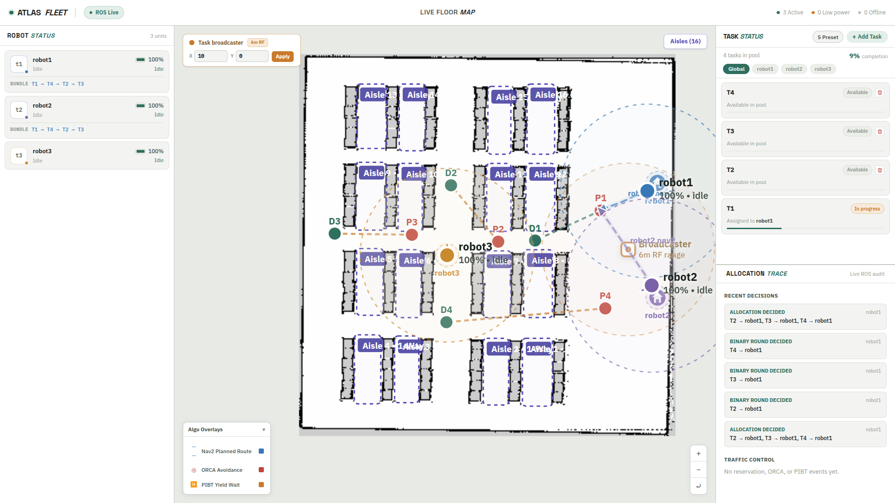
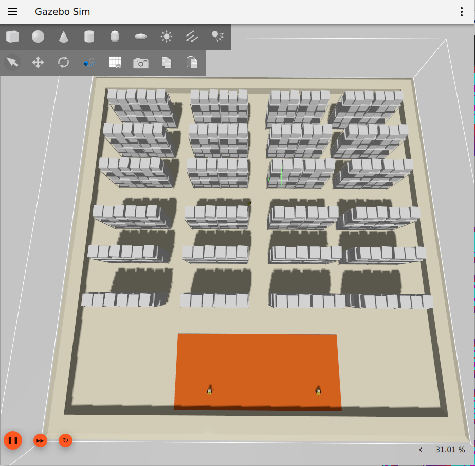
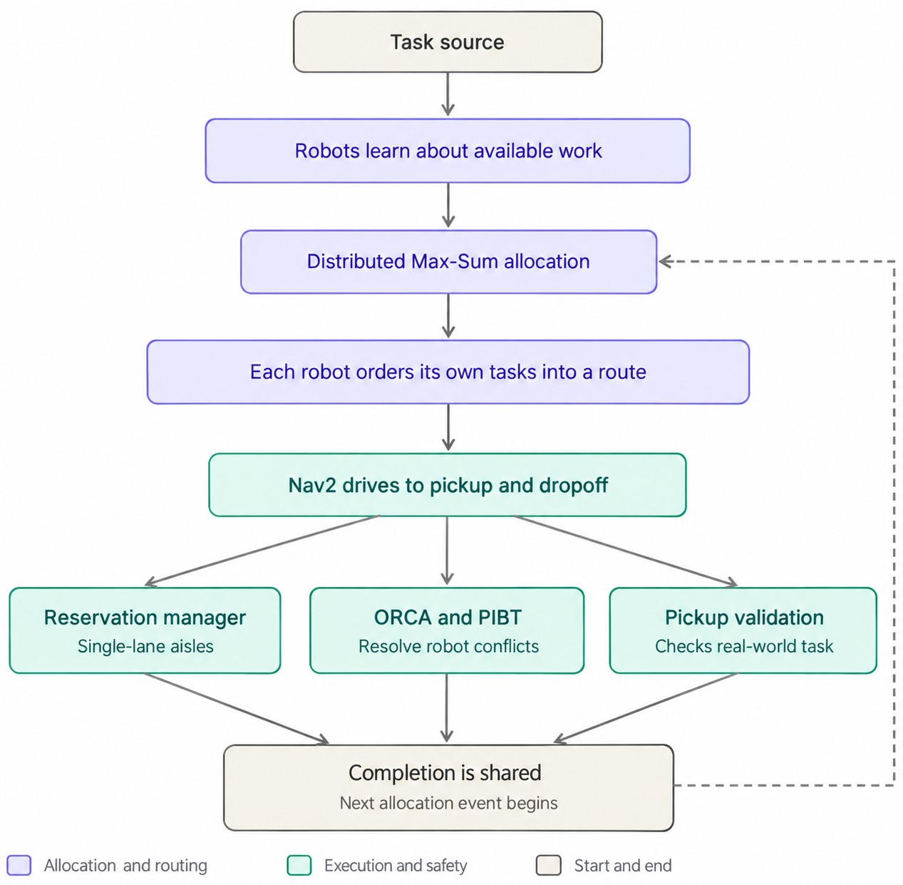
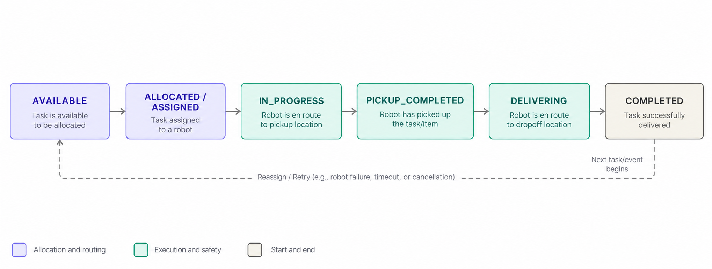
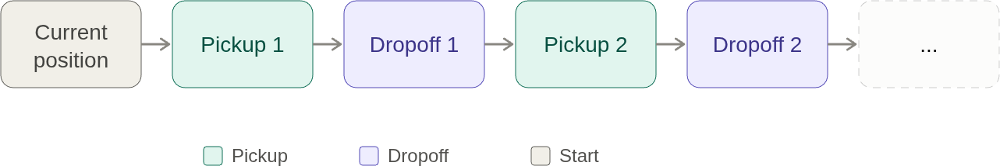

 # FleetManager

[Watch the FleetManager video demo](media/Fleet-Managment.mp4)

<video src="media/Fleet-Managment.mp4" width="800" controls> Your browser is doesn't support video tag</video>

FleetManager is a decentralized ROS 2 fleet-management system for a simulated warehouse. Multiple robots share work, negotiate ownership, plan their own routes, coordinate through narrow aisles, and report progress without relying on one central allocator.

The important idea is that the system separates **who should do a task**, **in what order**, and **how robots safely move**. Each concern has its own decision-maker, so a temporary communication gap or a blocked robot does not require the entire fleet to stop.

## The User Interface

The web interface is an operator dashboard for understanding what the fleet is doing while it is working. It does not replace the decentralized decision-making inside the robots. Instead, it collects the current fleet state and presents the result as a live warehouse view.

### Website UI



### Gazebo UI



### Robot status

The robot panel shows each robot's identity, connection state, battery level, and current activity. This lets an operator quickly see whether a robot is available, executing a task, charging, offline, or in maintenance. Battery indicators change as the robot approaches a low-power condition.

### Live warehouse map

The central map shows the warehouse layout together with:

- robot positions and movement;
- pickup and dropoff points for tasks;
- task labels and progress markers;
- planned navigation paths;
- single-lane aisle regions and traffic information;
- dock or broadcaster positions when they are available.

The map can be zoomed, reset, and panned. To create a task from the interface, the operator enters task-selection mode and chooses an open pickup point followed by an open dropoff point. Wall areas are rejected so that a task cannot accidentally be created on an occupied map cell.

### Task status

The task panel shows the current queue and makes ownership visible. Each task displays whether it is unassigned or assigned, which robot owns it, and how far it has progressed. Unassigned tasks can be removed, while new tasks can be added from the map. The panel also reports the fleet's overall on-time completion percentage.

### Efficiency timeline

The efficiency timeline gives an overview of task scheduling over time. It distinguishes work that is waiting, active, completed, or delayed and overlays the current point in time. The timeline can be minimized for more map space or expanded when the operator needs a broader view of fleet throughput.

### Live data flow

The frontend connects to ROS through `rosbridge_websocket` at `ws://localhost:9090`. It listens for robot states, task updates, ownership changes, local bundles, world-view updates, navigation plans, reservations, allocator decisions, and traffic events. ROS coordinates are converted into map coordinates for display, and the interface automatically reconnects if the WebSocket connection is interrupted.

The same operational state can also be inspected in RViz. The web interface is intended for a quick fleet-wide overview and task interaction, while RViz remains useful for detailed robotics visualization and navigation debugging.

## How The System Works

At a high level, the system follows this loop:



There is a task broadcaster, but it does not assign work. It only introduces tasks to the fleet. Ownership is decided by the robots using the information they currently have and the robots they can currently reach.

## The Task Lifecycle

Every task represents a pickup pose, a dropoff pose, and a priority. Its state progresses through a guarded lifecycle:



The states have physical meaning:

- **Available**: the task is waiting for an owner.
- **Allocated / assigned**: a robot has won ownership and placed the task in its local work queue.
- **In progress**: the robot is travelling to the pickup location.
- **Pickup completed**: the item was found and picked up.
- **Delivering**: the robot is travelling with the item to the dropoff location.
- **Completed**: the delivery finished.
- **Blocked, failed, or cancelled**: the task needs recovery, is no longer feasible, or has been ended.

Once a robot has physically started a task, later stale messages cannot roll the task back to an earlier state. Pickup-completed and delivery work are treated as committed and are protected from ordinary reallocation.

## How Tasks Are Allocated

When a robot receives new work, it does not simply claim the nearest task. The robots run a distributed Max-Sum optimization over the affected tasks and reachable candidate robots.

The allocation considers factors such as:

- travel distance and estimated travel time;
- the robot's current route and workload;
- battery feasibility;
- task priority;
- whether the robot is reachable over the simulated peer-to-peer network;
- stability of the existing assignment.

Max-Sum is **event-driven**, rather than continuously recomputing the entire fleet on every timer tick. Typical triggers are a new task, a blocked task, a robot joining or reconnecting, a task completing, a pickup-validation result, or an execution failure.

Only the affected part of the allocation problem is reconsidered. This keeps changes local and avoids repeatedly moving tasks between robots for tiny differences in estimated cost. A stability bonus and protection rules prevent allocation thrashing:

- tasks already being carried or delivered are not casually transferred;
- terminal tasks are excluded;
- a queued or pre-pickup task can be reassigned when a meaningful improvement exists;
- a robot that reconnects can participate in a new allocation round.

## How Robots Agree Without A Central State Server

Each robot maintains a local view of robots and tasks. Robots exchange state using beacons and point-to-point messages whose delivery is limited by communication range and can optionally include packet loss.

Task and robot updates are merged with a Lamport-clocked, last-writer-wins CRDT. This gives the fleet deterministic behavior when messages arrive late, arrive out of order, or arrive more than once:

1. Each update carries its origin and logical timestamp.
2. Duplicate operations are ignored.
3. Newer logical updates win; equal timestamps use a deterministic robot-id tie-break.
4. A physical-state lock prevents an old update from downgrading work that has already begun.
5. When a connection returns, peers can exchange a complete world view and catch up.

The simulation also models radio reachability. A robot outside the broadcaster's range does not immediately receive new task broadcasts, and a robot outside peer range cannot use another robot's ownership update as if it had heard it directly. This makes communication topology part of the fleet behavior rather than an invisible assumption.

## From Ownership To A Route

Max-Sum decides ownership, not the order in which one robot executes its work. After ownership changes, the local bundle manager builds an ordered queue.

For each possible task order, it estimates the route:



For small bundles it evaluates every permutation. For larger bundles it uses a cheapest-insertion strategy. In-progress work stays locked while the remaining queue is reorganized around it.

The resulting bundle gives the execution layer one current task and a list of remaining tasks. A completed task is removed, and the next task is selected without requiring a new fleet-wide allocation unless an allocation event is triggered.

## How A Robot Executes A Task

The execution bridge connects the local bundle to Nav2's `NavigateToPose` action server. It drives the task state machine as follows:

1. Navigate to the pickup pose.
2. Confirm arrival within the configured tolerance.
3. Validate that the physical item exists when pickup validation is enabled.
4. Mark the pickup complete and begin navigation to the dropoff pose.
5. Confirm delivery and publish completion.
6. Return to the robot's dock or begin the next queued task.

The bridge can run with Nav2 enabled for the full simulation or in fallback simulation mode for tests where the action server is unavailable. It also pauses and resumes navigation when traffic coordination requires the robot to wait.

## Traffic And Collision Coordination

Task allocation answers a planning question. It does not guarantee that two robots can safely occupy the same space. FleetManager therefore uses a separate physical coordination layer.

### Open areas: ORCA

In open space, ORCA computes velocity constraints from nearby robot positions and velocities. Each robot adjusts its commanded velocity so predicted trajectories maintain a safety margin. The conflict resolver can override motion only when a physical conflict or choke-point wait requires it; Nav2 remains the normal navigation authority.

### Narrow aisles: reservations and PIBT

Single-lane aisles are modeled as spatial regions. A robot must request an exclusive reservation before entering one. If several robots request the same aisle, requests are ordered deterministically by:

1. higher task priority;
2. earlier Lamport timestamp;
3. robot id as a stable tie-break.

Only one robot can hold an aisle reservation at a time. Other robots wait in a queue, and the next eligible robot is promoted after release. A heartbeat and safety lease expiry recover an aisle if its holder disappears. ORCA is disabled inside these single-lane regions because reciprocal velocity avoidance is not appropriate when there is no room to pass; PIBT handles the discrete waiting and backtracking decisions instead.

## Pickup Validation And Recovery

The system does not assume that reaching a coordinate means the item was successfully picked up. When the item is absent, the robot publishes a pickup observation.

Other robots compare that observation with their replicated world view:

- if another robot is actively executing or has completed the task, the observation confirms the other owner and the reporting robot drops its stale ownership;
- if no confirmed owner exists, the task is considered stale and becomes eligible for a new allocation;
- duplicate observations are safely ignored using observation ids.

This lets the fleet recover from stale assignments and inconsistent knowledge without allowing two robots to continue believing they own the same physical item.

## Running The System

The project targets ROS 2 Humble and uses Gazebo/Nav2 for the simulated robots.

Build the ROS workspace:

```bash
colcon build --symlink-install
source install/setup.bash
```

Launch three robots and the fleet manager:

```bash
ros2 launch fleet_manager fleet_manager.launch.py
```

Launch with sample tasks automatically created:

```bash
ros2 launch fleet_manager fleet_manager.launch.py auto_generate_tasks:=true
```

Useful launch controls include:

```bash
# Use a larger simulated peer-to-peer range
ros2 launch fleet_manager fleet_manager.launch.py communication_radius:=15.0

# Start without the RViz task visualizer
ros2 launch fleet_manager fleet_manager.launch.py launch_visualizer:=false
```

The task broadcaster can also create tasks through its ROS service, while the frontend can publish task batches and runtime configuration such as dock position or aisle geometry.

Start the web interface separately:

```bash
cd frontend
npm install
npm run dev
```

For live frontend data, run rosbridge in another terminal:

```bash
ros2 launch rosbridge_server rosbridge_websocket_launch.xml
```

The frontend then uses the default WebSocket endpoint `ws://localhost:9090`. Set `VITE_ROSBRIDGE_URL` when rosbridge is hosted elsewhere.

## Design Boundaries

The system stays understandable because each layer has a narrow responsibility:

- **Task source** creates and broadcasts work.
- **Distributed state** makes robot and task knowledge converge.
- **Max-Sum** decides task ownership.
- **Bundle planning** orders each robot's owned work.
- **Nav2 execution** performs pickup and delivery.
- **Pickup validation** checks physical reality and repairs stale ownership.
- **Reservation management** protects single-lane resources.
- **Conflict resolution** handles immediate motion conflicts.
- **Visualization** exposes the resulting state to operators.

That separation is the core of FleetManager: global work distribution, local route planning, and real-time motion safety can evolve independently while sharing the same distributed view of the warehouse.
